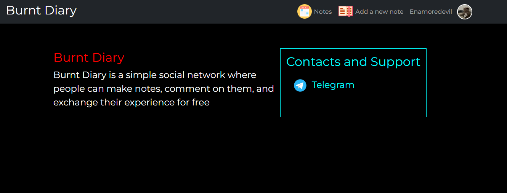
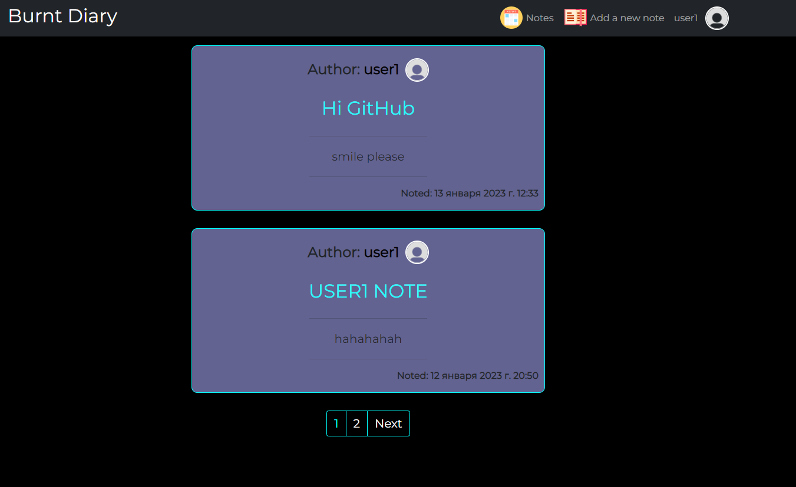
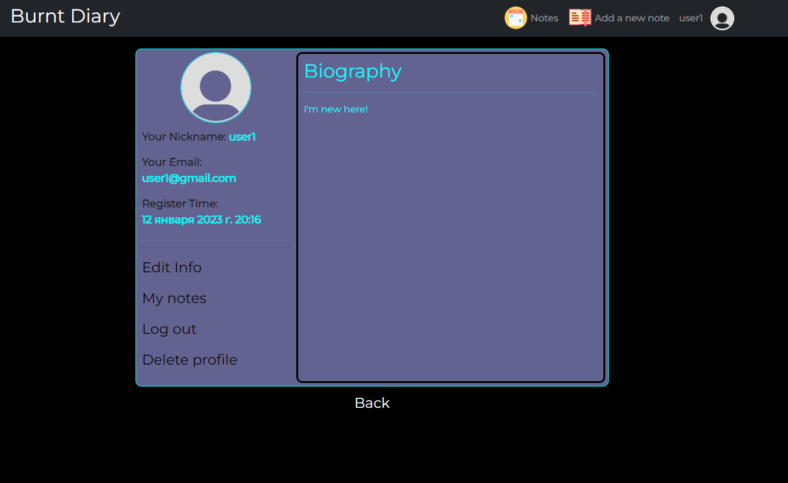
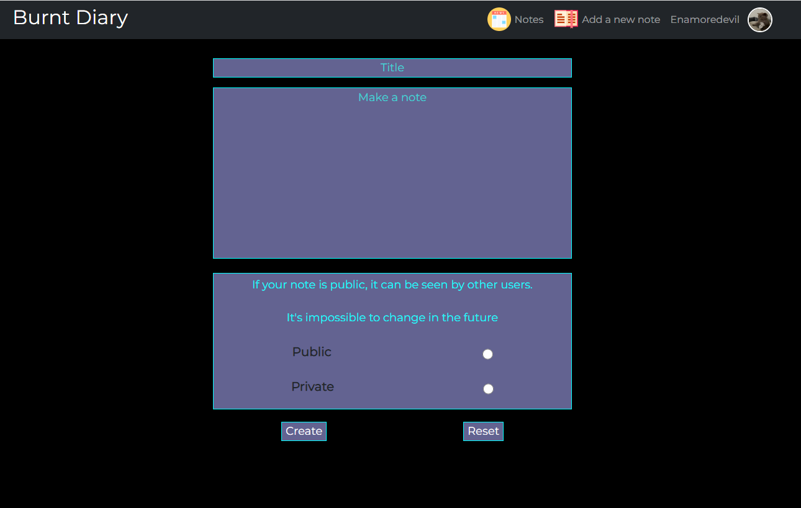
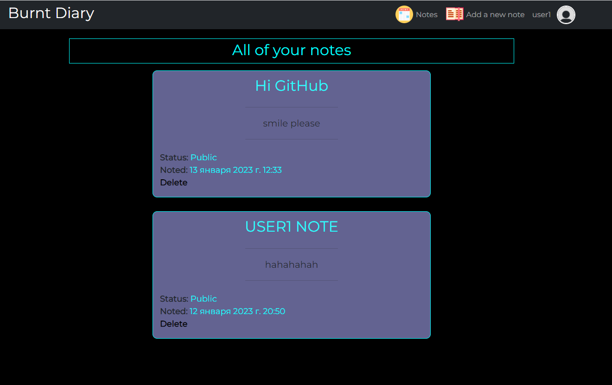
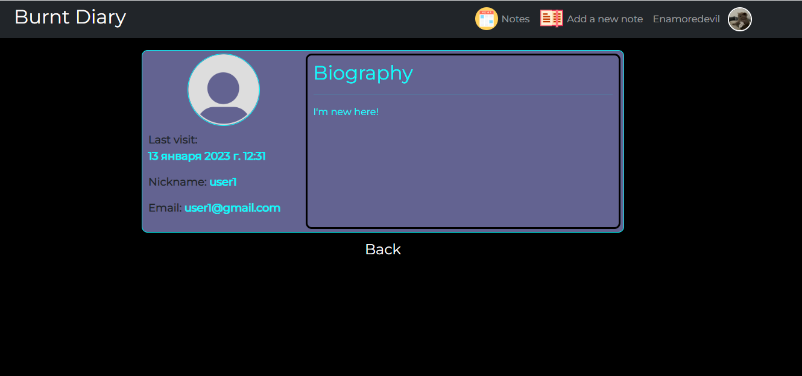

### My mini social network (Django + HTML/CSS + JS)

---

Here is my first pet project which is a mini social network-blog. It's not perfect and contains a bit JavaScript which is actually not coded by me. Anyway, The Backend part and most of HTML/CSS are coded by me from scratch.

---
#### Enter page

---

#### Here is the page where all public notes are stored

---

#### Profile page

---

#### The page where one can make either public or private notes

---

#### The page where all of your notes are stored (You can delete them or see if they're public or private)

---
#### You can watch the profile of another person with the following information:

---
### Thanks for watching